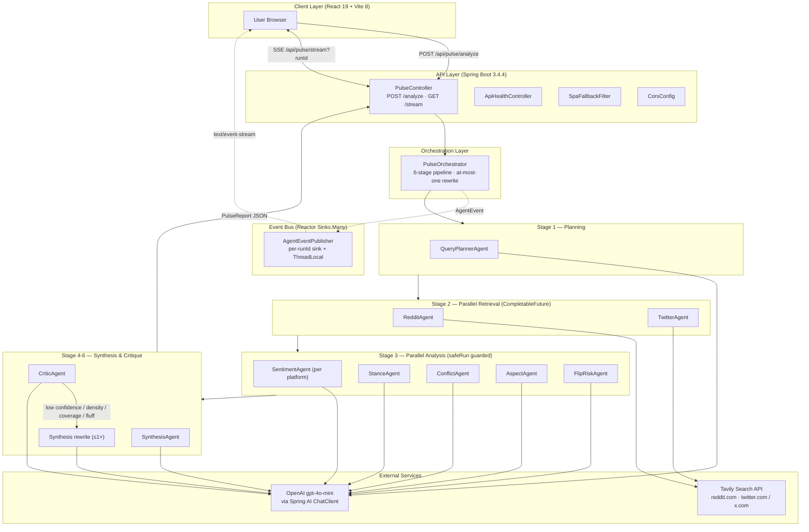

# Pulse — 多智能体舆情分析系统(AI Agent 编排 + 全栈服务)

> 项目类型判断:**混合类(以 B 类 AI Agent / LLM 应用为核心,辅以 A 类后端基础设施)**
> 判断依据:
> - 核心代码是 10 个领域专属 Agent(`backend/src/main/java/com/odieyang/pulse/agent/*`),由 `PulseOrchestrator` 编排,LLM 调用全部走 Spring AI `ChatClient` + OpenAI `gpt-4o-mini`,带"Critic 评分 → 触发一次定向重写"的 agent loop;
> - 同时是一个真实可部署的 Spring Boot 3.4.4 服务:对外暴露 REST + SSE,集成外部检索 API(Tavily),用 Maven `frontend-maven-plugin` 把 React 前端打进同一个 Jar,Dockerfile 多阶段构建,live demo 部署在 `pulse.odieyang.com`。

## 项目描述

Pulse 把"输入一个话题 → 在 X / Reddit 之间来回切标签页 → 自己脑补结论"的人工流程,替换成"一次提问、一份带证据、带置信度的结论性报告"。后端用 10 个职责分离的 LLM 智能体(查询规划、双平台抓取、情感/立场/冲突/方面/翻转风险、综合、评论员)串成一条管线,通过 Critic 智能体打出 confidence / 信息密度 / 主张-证据覆盖度三个维度的分数,只要任一指标低于阈值就触发一次定向 rewrite。前端用 SSE 把每个 agent 的 `STARTED / COMPLETED / FAILED` 事件实时打到"Agent Theater"轨迹界面,让 LLM 流程从黑盒变成可视化执行轨迹。

## 架构图

## 它在 AI 链路里的位置

- **输入**:用户在 React 前端提交一个自然语言话题(例如某事件、某产品、某政策)+ 可选 `runId` / `locale`。
- **上游 LLM**:OpenAI `gpt-4o-mini`,经 Spring AI 1.0.0 的 `ChatClient.prompt().system(...).user(...).call().entity(POJO.class)` 做结构化 JSON 输出。
- **上游工具**:Tavily Search API,带 `include_domains=reddit.com` / `twitter.com,x.com` 做平台定向检索。
- **下游产出**:`PulseReport` JSON(综合报告 markdown、Critic 评分、立场分布、争议主题、翻转风险信号、引文证据链、抓取统计、完整 agent 执行 trace)。
- **角色**:一条"LLM 编排服务"——前端只看到一次 HTTP 请求 + 一条 SSE 通道,Pulse 后端是把"规划 → 抓取 → 多维分析 → 综合 → 自评 → 一次定向重写"组装成可解释 agent loop 的中间层。

## Agent 架构

### a. Agent 编排
- **形态**:多智能体,固定有向管线 + 单次 Critic-loop 回路,不是通用的 ReAct。`PulseOrchestrator#analyze(topic, runId, locale)`(`orchestrator/PulseOrchestrator.java`)硬编码 6 个阶段:
  1. `QueryPlannerAgent.plan(topic)` → `QueryPlan(redditQueries, twitterQueries, topicSummary)`
  2. `RedditAgent.fetch(...)` 和 `TwitterAgent.fetch(...)` 用 `CompletableFuture.supplyAsync` 并行抓取
  3. 5 个分析 agent(Sentiment×2、Stance、Conflict、Aspect、FlipRisk)同样用 `CompletableFuture` 并行执行,失败时用 `safeRun(...)` 返回各自的 default 结果而不打断管线
  4. `SynthesisAgent.synthesizeWithCoreEntity(...)` 出第一版 6 段式综合报告
  5. `CriticAgent.critique(...)` 给出 `confidenceScore` + `informationDensityScore` + `claimEvidenceCoverage` + `fluffFindings`
  6. 若任一指标低于 `debate.confidence.threshold` / `debate.quality.min-density` / `debate.quality.min-claim-coverage`(默认 60 / 55 / 60),`buildRewriteGuidance(...)` 拼出定向指令,Synthesis agent 跑一次 rewrite,只重写一次,不递归
- **框架**:没有用 LangChain / LangGraph,直接 Spring AI + 自己手写的编排器,所有 agent 是 Spring `@Component`,通过构造器注入到 orchestrator。

### b. LLM 对接
- Provider:**OpenAI**,模型 `gpt-4o-mini`(`application.properties`: `spring.ai.openai.chat.options.model=gpt-4o-mini`)。
- SDK:**Spring AI 1.0.0**(`spring-ai-bom` + `spring-ai-starter-model-openai`),全局一个 `ChatClient` Bean(`config/AiConfig.java`)。
- 调用模式:**单轮结构化输出**,统一走 `chatClient.prompt().system(SYSTEM_PROMPT).user(userPrompt).call().entity(SomePojo.class)`,Spring AI 负责把 LLM 返回的 JSON 反序列化成 Java record/POJO(如 `QueryPlan`、`SentimentResult`、`CriticResult`)。
- **没有用 streaming / function calling / tool calling**,LLM 在这个系统里是"按 JSON Schema 出结果的纯文本生成器",真正的"tool"是 Tavily,由 orchestrator 显式调度,不是让 LLM 自己决定调用。

### c. Tool / 工具层
- 唯一外部工具:`TavilySearchService`(`service/TavilySearchService.java`),用 Spring 6 `RestClient` 调 `POST https://api.tavily.com/search`,请求体携带 `api_key` / `query` / `include_domains` / `max_results`,响应空 / 异常时降级为 `List.of()` 不抛出。
- 调度方式:**确定性,非 LLM-driven**。`RedditAgent` 用 `List.of("reddit.com")`,`TwitterAgent` 用 `List.of("twitter.com", "x.com")` 调用同一个 service。

### d. Context / Memory
- **没有外部向量库,没有 RAG,没有跨请求记忆**。每次 `/analyze` 是一次独立的 stateless 调用。
- 每个 agent 的 context 都是 orchestrator 现场拼装的:querystring / 抓取到的原始 post 文本 / 上一阶段的结构化结果作为 `user` 消息塞进 prompt。
- `SynthesisAgent` 里有一套"证据库 / 引文匹配"的本地启发式(在 `PulseOrchestrator` 里有 ~700 行的 claim-evidence 评分:`claimKeywords / claimRelevanceScore / pickEvidenceUrlsForClaim / isMechanicalCitationPairing` 等),负责把每条核心 claim 与 Tavily 抓回的引文做去重 + 跨平台多样性 + 反"机械配对"挑选,本质是个不靠 embedding 的关键词 + 启发式打分。

### e. 可靠性 / 控制
- **per-agent 兜底**:`safeRun(Supplier, defaultResult, "AgentName")` 在 orchestrator 里包住所有抓取 / 分析 agent,失败发 `AgentEvent.failed` 事件 + 返回 default,管线不崩。
- **Critic 单次 rewrite**:只重写一次,即便第二轮还是低分也直接交付,避免死循环(`PulseOrchestrator.analyze` 第 ~218-237 行)。
- **超时**:前端 `frontend/src/lib/api.js` 用 `AbortController` + `VITE_ANALYZE_TIMEOUT_MS`(默认 120s)做整体请求超时;Tavily 抓取无显式超时。
- **降级综合**:`isValidReporterSynthesis(...)` 校验 LLM 输出是否包含 6 个固定 markdown section、没有原始评分 / 原始 dump 残留;校验不过用 `buildReporterFallback(...)` 本地拼一份确定性 6 段报告,保证前端永远拿得到一份结构化结果。
- **限流 / 成本控制**:没看到代码级 rate limit 或 token budget 控制,主要靠"每个请求最多 1 次重写"+ `tavily.max-results`(默认 4)间接控制。

### f. 评估 / 可观测
- **Trace**:`AgentEventPublisher`(`service/AgentEventPublisher.java`)用 Reactor `Sinks.Many.multicast().onBackpressureBuffer()` 做事件总线,**按 `runId` 维护独立 sink**(`ConcurrentHashMap<String, Sinks.Many<AgentEvent>>`),并用 `ThreadLocal<String> activeRunId` + `withRunContext(runId, supplier)` 把"是哪个 run 触发的事件"绑到调用线程上,保证并发请求互不串流。
- **Critic 自评分**:作为 LLM-as-judge,产出 `confidenceScore` / `informationDensityScore` / `claimEvidenceCoverage` / `unsupportedClaims` / `biasConcerns` / `evidenceGaps`,这些字段也直接进 `PulseReport` 让前端展示。
- **日志**:每个 agent 用 `org.slf4j.Logger` 打 `started → completed in {duration}ms` 结构化日志。
- **Actuator**:`spring-boot-starter-actuator`,通过 `ApiHealthController` 暴露 `/api/actuator/health` 包装端点。
- **没有外部 LLM observability(没有 Langfuse / OpenTelemetry / Helicone 之类的接入)**,trace 仅在请求生命周期内通过 SSE 推前端 + 进 `PulseReport.executionTrace` 持久到响应 JSON。

### g. 工程化
- **后端**:Spring Boot 3.4.4 / Java 21 / Maven。同时引入 `spring-boot-starter-web`(MVC + Servlet 容器)和 `spring-boot-starter-webflux`(为了 SSE 用 Reactor `Flux`)。`me.paulschwarz:spring-dotenv:4.0.0` 加载 `.env`。
- **API**:`PulseController`(`/api/pulse` 和兼容旧路径 `/pulse`)暴露 `POST /analyze`(同步 JSON)与 `GET /stream?runId=...`(`text/event-stream`)。
- **CORS**:`CorsConfig` 从 `cors.allowed-origins` 读白名单,默认放 `localhost:5173 / pulse.odieyang.com`。
- **前端**:React 19.2.4 + Vite 8 + TailwindCSS 4 + `@xyflow/react`(agent 编排可视化)+ framer-motion + recharts + react-markdown,组件覆盖 ControversyBoard / CampBattleBoard / SentimentChart / DramaScoreboard / ConfidenceGauge / AgentTheaterLoading / QuoteCards 等,Vitest + Testing Library 做单测。
- **单 Jar 部署**:`pom.xml` 用 `frontend-maven-plugin 1.15.1` 在 `prepare-package` 阶段安装 Node 22.12.0 + npm 10.8.2、跑 `npm install && npm run build`,然后用 `maven-resources-plugin` 把 `frontend/dist` 拷到 Spring Boot 的 `static/` 里,`SpaFallbackFilter` 把所有非 `/api/**` 的 HTML GET 请求 forward 到 `/index.html` 走 SPA。
- **容器化**:`Dockerfile` 多阶段构建,build stage 用 `maven:3.9.9-eclipse-temurin-21`,runtime 用 `eclipse-temurin:21-jre-jammy`,暴露 `8080`,`ENTRYPOINT` 走 `java $JAVA_OPTS -jar /app/pulse.jar`。
- **生产部署**:在 **Railway** 上跑同一个 Spring Boot Jar(由 Dockerfile 构建出的镜像直接托管),自定义域名 [pulse.odieyang.com](https://pulse.odieyang.com)(CORS 白名单已开此域名)。
- **测试**:后端有 `PulseOrchestratorV2Tests`、`PulseControllerV2Tests`、`SynthesisAgentFormattingTests`、`TwitterAgentTests`、`AgentEventPublisherTests`、`PulseReportSerializationTests`;前端有 ~9 个组件 / hook / lib 测试文件(QuoteCards、ControversyAccordion、ControversyBoard、AgentTheaterLoading、ConfidenceGauge、SemanticSourceChip、DramaScoreboard、usePulseV2、apiCitationSources、apiNormalizeReport、controversyMapper)。

### h. 其他值得说的设计决策
- **管线编排放在 Java 这边,不让 LLM 自己 plan-execute**。给定话题→怎么走管线是确定的,LLM 只负责"在每一步把自然语言变结构化数据"和"最后写出报告"。这样 trace、并发、降级、超时控制全部可控。
- **Critic 不是"再问一次 LLM 是否同意",而是出结构化分数 + 字段级原因**(unsupported claims、bias concerns、fluff findings、evidence gaps、density、coverage),让 orchestrator 用纯 Java 逻辑判断要不要重写,以及拼出 rewrite guidance。
- **"机械引文配对"反作弊**:`isMechanicalCitationPairing` 检测两条相邻 claim 是不是被 LLM 用了 `[Q1][Q2] → [Q2][Q3]` 这种偷懒模式,如果是就用打分系统强制换一组跨平台的引文,确保 quick take 每条 claim 的证据是真匹配而不是循环引用。

## 简历可用 bullet 草稿

- **多智能体公共舆情分析平台 (Pulse)** —— 设计并实现了一条 10-Agent 的 LLM 编排管线(Query Planner / Reddit / Twitter / Sentiment / Stance / Conflict / Aspect / FlipRisk / Synthesis / Critic),用 Spring Boot 3.4.4 + Spring AI 1.0.0 + OpenAI `gpt-4o-mini` 把"输入话题 → 抓取双平台讨论 → 多维分析 → 综合报告 → Critic 自评 → 一次定向重写"包装成可解释的 agent loop,代码量约 [待确认: 后端 Java ~5,160 行 + 前端 React `<待确认>` 行]。
- **Critic-as-judge 重写回路** —— 设计了一套基于 `confidenceScore` / `informationDensityScore` / `claimEvidenceCoverage` / `fluffFindings` 四维度的 LLM 自评分系统,只要任一维度低于阈值(60 / 55 / 60)就在 Java 层拼出 rewrite guidance 触发 Synthesis Agent 单轮定向重写,在不进入死循环的前提下显著降低低质量报告的产出率 [待确认: 重写命中率 / 重写后分数变化]。
- **per-runId SSE 实时 trace** —— 用 Reactor `Sinks.Many.multicast()` + `ConcurrentHashMap<runId, Sink>` + `ThreadLocal<runId>` `withRunContext` 把每个 agent 的 `STARTED / COMPLETED / FAILED` 事件按请求隔离推送给前端,实现"Agent Theater" 可视化执行轨迹,把 LLM 流程从黑盒变成可观测过程;并发请求互不串流。
- **可靠性工程** —— 用 `CompletableFuture` 并行化抓取 + 分析阶段;用 `safeRun(Supplier, default, name)` 包装每个 agent 失败时返回默认结果而不打断管线;对 LLM 综合输出做 6-section markdown 格式与"raw dump / 机械引文配对 / Frankenstein 实体"等多重校验,失败时回落到本地确定性 fallback,保证响应永远是合法 `PulseReport`。
- **全栈交付 + 单 Jar 部署** —— React 19 + Vite 8 + Tailwind 4 + `@xyflow/react` 前端用 Maven `frontend-maven-plugin` 在 `prepare-package` 阶段构建并嵌入 Spring Boot Jar,`SpaFallbackFilter` 承担 SPA 路由,多阶段 Dockerfile(maven + temurin-21-jre)产出单镜像,部署到 **Railway** + 自定义域名 [pulse.odieyang.com](https://pulse.odieyang.com)。

## ⚠️ 需我本人确认 / 补充的点

- **真实指标全部空缺**:QPS、平均一次 analyze 的 P50/P95 延迟、每个 agent 的平均耗时、单次 token 消耗 / 美元成本、Critic 触发 rewrite 的命中率、rewrite 后分数提升幅度、Tavily 命中率、deduped 比例—— 仓库里都没固化数据,需要你自己跑几次 demo 用日志统计。
- **代码规模**:后端 Java 代码 `wc -l` 数到 5,159 行(含测试),但前端 React 行数没数,需要补;agent 数量按 `agent/` 目录是 10 个,但简历上写"10 个 agent"还是合并表述需要自己定。
- **配置默认值已对齐到代码真实值**:`tavily.max-results=4`、`crawler.target-total=16`、`crawler.relevance.min-score=4`、`crawler.relevance.min-retain-count=2`、`crawler.relevance.min-retain-ratio=0.15`、`crawler.relevance.max-hashtags=2`(以 `application.properties` 为准,`.env.example` 已同步更新)。如果你跑 demo 时想用更"激进"的抓取参数(老 `.env.example` 里的 50 / 10 之类),建议作为"高吞吐档"在简历里单独列出来,而不是当默认值。
- **没找到的东西(不要往简历里写)**:数据库、Redis、消息队列、向量库 / RAG、function calling / tool use、多轮对话记忆、streaming LLM 输出、Kubernetes manifests、`.github/workflows` CI/CD、docker-compose、APM / Langfuse / OpenTelemetry 集成、限流、auth/authz、用户系统 —— 这些项目里都没有。
- **测试覆盖率 / 测试数量**:简单数到了几个 test 文件,具体单测条数 / 覆盖率没跑,需要补。
- **用户量 / demo 使用量**:0、需要自己补。
