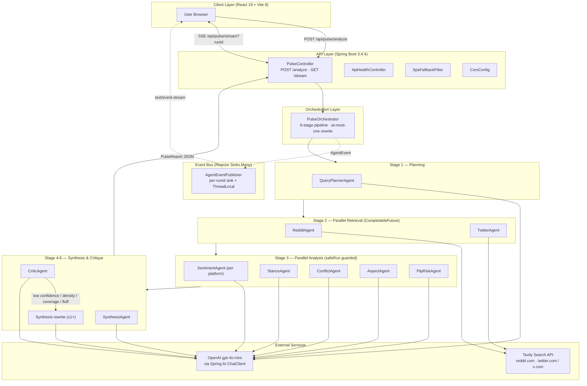

# Pulse — Multi-Agent Public Opinion Analysis System (AI Agent Orchestration + Full-Stack Service)

> Project type: **Mixed (primarily B-class AI Agent / LLM application, on top of a real A-class Spring Boot backend)**
> Why:
> - The core is 10 domain-specialized LLM agents under `backend/src/main/java/com/odieyang/pulse/agent/*`, choreographed by `PulseOrchestrator`. All LLM calls go through Spring AI `ChatClient` + OpenAI `gpt-4o-mini`, with a `Critic → scored rewrite` agent loop.
> - It is also a real deployable Spring Boot 3.4.4 service: REST + SSE on the wire, Tavily as an external retrieval tool, Maven `frontend-maven-plugin` to bundle a React frontend into the same fat-jar, a multi-stage Dockerfile, and a live demo at `pulse.odieyang.com`.

## Project Description

Pulse replaces the manual "open one topic → tab-switch across X and Reddit → guess a conclusion" workflow with "one query, one defensible report with citations and a confidence score". The backend strings together 10 single-responsibility LLM agents (query planning, dual-platform retrieval, sentiment / stance / conflict / aspect / flip-risk analyzers, synthesis, critic) into a pipeline. A Critic agent scores the synthesis on three axes (confidence, information density, claim-evidence coverage), and if any axis falls below threshold, the orchestrator triggers exactly one targeted rewrite. The frontend streams every agent's `STARTED / COMPLETED / FAILED` event over SSE into an "Agent Theater" view, turning the LLM pipeline from a black box into a visible execution trace.

## Architecture Diagram

## Position in the AI Stack

- **Input**: a natural-language topic (event, product, policy, …) submitted from the React frontend, plus optional `runId` / `locale`.
- **Upstream LLM**: OpenAI `gpt-4o-mini`, invoked through Spring AI 1.0.0 with `ChatClient.prompt().system(...).user(...).call().entity(POJO.class)` for structured JSON output.
- **Upstream tool**: the Tavily Search API, with `include_domains=reddit.com` / `twitter.com,x.com` for platform-scoped retrieval.
- **Downstream output**: a `PulseReport` JSON (synthesis markdown, critic scores, stance/camp distribution, controversy topics, flip-risk signals, claim-evidence links, crawler stats, full agent execution trace).
- **Role**: an "LLM orchestration service" — the frontend sees one HTTP call plus one SSE channel; Pulse is the middle layer that turns "plan → retrieve → multi-axis analyze → synthesize → self-critique → at-most-one targeted rewrite" into a deterministic, explainable agent loop.

## Agent Architecture

### a. Agent Orchestration
- **Shape**: multi-agent, with a fixed directed pipeline and a single-pass Critic loop — not a generic ReAct loop. `PulseOrchestrator#analyze(topic, runId, locale)` (`orchestrator/PulseOrchestrator.java`) hard-codes six stages:
  1. `QueryPlannerAgent.plan(topic)` → `QueryPlan(redditQueries, twitterQueries, topicSummary)`.
  2. `RedditAgent.fetch(...)` and `TwitterAgent.fetch(...)` run in parallel via `CompletableFuture.supplyAsync`.
  3. Five analyzer agents (two `SentimentAgent` runs per platform, plus `Stance`, `Conflict`, `Aspect`, `FlipRisk`) also run in parallel via `CompletableFuture`. Each is wrapped in `safeRun(Supplier, defaultResult, "AgentName")` so a single failure does not break the pipeline.
  4. `SynthesisAgent.synthesizeWithCoreEntity(...)` produces the first 6-section markdown report.
  5. `CriticAgent.critique(...)` returns `confidenceScore`, `informationDensityScore`, `claimEvidenceCoverage`, `fluffFindings`, etc.
  6. If any score falls below `debate.confidence.threshold` / `debate.quality.min-density` / `debate.quality.min-claim-coverage` (defaults 60 / 55 / 60), `buildRewriteGuidance(...)` assembles a targeted instruction string and `SynthesisAgent` is invoked exactly once more — the loop never recurses.
- **Framework**: no LangChain / LangGraph. Pure Spring AI plus a hand-rolled Java orchestrator. Each agent is a Spring `@Component`, constructor-injected into the orchestrator.

### b. LLM Integration
- Provider: **OpenAI**, model `gpt-4o-mini` (`spring.ai.openai.chat.options.model=gpt-4o-mini` in `application.properties`).
- SDK: **Spring AI 1.0.0** (`spring-ai-bom` + `spring-ai-starter-model-openai`), one shared `ChatClient` bean (`config/AiConfig.java`).
- Call pattern: **single-turn, structured output only**. Every agent calls `chatClient.prompt().system(SYSTEM_PROMPT).user(userPrompt).call().entity(SomePojo.class)` and Spring AI deserializes the JSON into Java records / POJOs (`QueryPlan`, `SentimentResult`, `CriticResult`, …).
- **No streaming, no function calling, no tool calling on the LLM side**. The LLM is a JSON-schema-conforming text generator; the only real "tool" is Tavily, and it is invoked deterministically by the orchestrator, not by the LLM.

### c. Tool / Tooling Layer
- One external tool: `TavilySearchService` (`service/TavilySearchService.java`). Uses Spring 6 `RestClient` to call `POST https://api.tavily.com/search` with `api_key` / `query` / `include_domains` / `max_results`. Empty or invalid Tavily payloads degrade silently to `List.of()`.
- Dispatch: **deterministic, not LLM-driven**. `RedditAgent` passes `List.of("reddit.com")`, `TwitterAgent` passes `List.of("twitter.com", "x.com")`, both reusing the same service.

### d. Context / Memory
- **No vector DB, no RAG, no cross-request memory**. Every `/analyze` is a fresh, stateless call.
- Each agent's prompt is assembled on the fly by the orchestrator: the natural-language query, the raw posts returned by Tavily, and structured outputs from previous stages, all pasted into the `user` message.
- `SynthesisAgent` and `PulseOrchestrator` carry a sizable local heuristic ("evidence bank" + claim-to-citation matching — see `claimKeywords / claimRelevanceScore / pickEvidenceUrlsForClaim / isMechanicalCitationPairing` in `PulseOrchestrator.java`, roughly 700 lines). It deduplicates citations, enforces cross-platform diversity, and detects "mechanical" citation pairing. It is keyword + heuristic scoring, not embedding-based.

### e. Reliability / Control
- **Per-agent guards**: every retrieval / analyzer agent is wrapped in `safeRun(Supplier, default, "AgentName")` which emits `AgentEvent.failed` and returns a default result so the pipeline survives single-agent failures.
- **At-most-one Critic rewrite**: a second low score does not trigger another rewrite — the pipeline ships whatever the rewrite produced (`PulseOrchestrator.analyze`, ~lines 218-237).
- **Timeout**: the frontend (`frontend/src/lib/api.js`) uses `AbortController` plus `VITE_ANALYZE_TIMEOUT_MS` (default 120s) for the overall request. Tavily calls have no explicit timeout in code.
- **Synthesis fallback**: `isValidReporterSynthesis(...)` checks the LLM output for the six required markdown sections and the absence of raw-score markers / raw-dump leakage / "Frankenstein entity" patterns. If it fails, `buildReporterFallback(...)` emits a deterministic 6-section report so the frontend never receives malformed structure.
- **Rate limiting / token budgeting**: not implemented at the code level. Cost is bounded indirectly by "at most one rewrite per request" and the `tavily.max-results` cap.

### f. Evaluation / Observability
- **Trace**: `AgentEventPublisher` (`service/AgentEventPublisher.java`) uses Reactor `Sinks.Many.multicast().onBackpressureBuffer()` as an event bus, **with a per-`runId` sink** kept in `ConcurrentHashMap<String, Sinks.Many<AgentEvent>>`. A `ThreadLocal<String> activeRunId` plus `withRunContext(runId, supplier)` binds the in-flight `runId` to the calling thread so concurrent requests never cross-stream events.
- **Critic as LLM judge**: emits `confidenceScore`, `informationDensityScore`, `claimEvidenceCoverage`, `unsupportedClaims`, `biasConcerns`, `evidenceGaps`. All of these are surfaced to the frontend through `PulseReport`.
- **Logging**: each agent uses `org.slf4j.Logger` with `started → completed in {duration}ms` style structured lines.
- **Actuator**: `spring-boot-starter-actuator` is enabled and `ApiHealthController` exposes a wrapper `/api/actuator/health`.
- **No external LLM observability** (no Langfuse / OpenTelemetry / Helicone). The trace lives only inside the request lifecycle and the response JSON (`PulseReport.executionTrace`).

### g. Engineering
- **Backend**: Spring Boot 3.4.4 / Java 21 / Maven. Pulls in both `spring-boot-starter-web` (MVC / servlet) and `spring-boot-starter-webflux` (Reactor `Flux` for SSE). `me.paulschwarz:spring-dotenv:4.0.0` loads `.env`.
- **API**: `PulseController` (mapped at both `/api/pulse` and legacy `/pulse`) exposes `POST /analyze` (synchronous JSON) and `GET /stream?runId=...` (`text/event-stream`).
- **CORS**: `CorsConfig` reads an allowlist from `cors.allowed-origins`; defaults include `localhost:5173`, `pulse-frontend-tawny.vercel.app`, and `pulse.odieyang.com`.
- **Frontend**: React 19.2.4 + Vite 8 + TailwindCSS 4 + `@xyflow/react` (agent-flow visualization) + framer-motion + recharts + react-markdown. Components include ControversyBoard, CampBattleBoard, SentimentChart, DramaScoreboard, ConfidenceGauge, AgentTheaterLoading, QuoteCards, etc. Vitest + React Testing Library for unit tests.
- **Single-jar deployment**: `pom.xml` uses `frontend-maven-plugin 1.15.1` in the `prepare-package` phase to install Node 22.12.0 + npm 10.8.2, run `npm install && npm run build`, then `maven-resources-plugin` copies `frontend/dist` into the Spring Boot `static/` resources. `SpaFallbackFilter` forwards non-`/api/**` HTML GET requests to `/index.html` so SPA routing works.
- **Containerization**: multi-stage `Dockerfile` — build on `maven:3.9.9-eclipse-temurin-21`, runtime on `eclipse-temurin:21-jre-jammy`, expose `8080`, `ENTRYPOINT ["sh", "-c", "java $JAVA_OPTS -jar /app/pulse.jar"]`.
- **Production deployment**: deployed to **Railway** (the same Spring Boot fat-jar image built by the Dockerfile is hosted directly), exposed at the custom domain [pulse.odieyang.com](https://pulse.odieyang.com) (CORS allowlist already includes this origin).
- **Tests**: backend has `PulseOrchestratorV2Tests`, `PulseControllerV2Tests`, `SynthesisAgentFormattingTests`, `TwitterAgentTests`, `AgentEventPublisherTests`, `PulseReportSerializationTests`. Frontend has ~9 component / hook / lib test files (QuoteCards, ControversyAccordion, ControversyBoard, AgentTheaterLoading, ConfidenceGauge, SemanticSourceChip, DramaScoreboard, usePulseV2, apiCitationSources, apiNormalizeReport, controversyMapper).

### h. Other Design Decisions Worth Calling Out
- **Pipeline orchestration lives in Java, not in the LLM**. The LLM is never asked to "plan-execute"; the orchestrator decides what to call next. This keeps trace, concurrency, fallback, and timeout behavior fully under code control.
- **Critic is not "ask another LLM if it agrees"** — it returns structured scores plus field-level reasons (`unsupportedClaims`, `biasConcerns`, `fluffFindings`, `evidenceGaps`, `informationDensityScore`, `claimEvidenceCoverage`). The orchestrator then makes the rewrite decision in pure Java and assembles the rewrite guidance from those fields.
- **Anti-mechanical-citation guard**: `isMechanicalCitationPairing` detects when adjacent claims cite `[Q1][Q2] → [Q2][Q3]`-style lazy patterns. When detected, a scoring-based picker swaps in a cross-platform citation pair so the quick-take's evidence is genuinely matched, not cyclically reused.

## Resume Bullet Drafts

- **Multi-agent public-opinion analysis platform (Pulse)** — designed and built a 10-agent LLM orchestration pipeline (QueryPlanner / Reddit / Twitter / Sentiment / Stance / Conflict / Aspect / FlipRisk / Synthesis / Critic) on Spring Boot 3.4.4 + Spring AI 1.0.0 + OpenAI `gpt-4o-mini`, turning "topic → cross-platform retrieval → multi-axis analysis → synthesis → self-critique → targeted rewrite" into an explainable agent loop. Codebase ~[TBD: ~5,160 lines Java + ~`<TBD>` lines React].
- **Critic-as-judge rewrite loop** — designed a four-axis LLM self-evaluation system (`confidenceScore`, `informationDensityScore`, `claimEvidenceCoverage`, `fluffFindings`); whenever any score falls below threshold (60 / 55 / 60), the orchestrator assembles a targeted rewrite-guidance string in Java and triggers exactly one Synthesis pass — bounding latency / cost while measurably lifting low-quality report rates [TBD: rewrite trigger rate / score lift after rewrite].
- **Per-`runId` SSE live trace** — used Reactor `Sinks.Many.multicast()` + `ConcurrentHashMap<runId, Sink>` + `ThreadLocal<runId>` `withRunContext` to push each agent's `STARTED / COMPLETED / FAILED` events to the right client over `text/event-stream`. Concurrent requests never cross-stream, and the "Agent Theater" frontend renders LLM execution as a visible trace instead of a black box.
- **Reliability engineering** — parallelized retrieval and analyzer stages with `CompletableFuture`; wrapped every agent in `safeRun(Supplier, default, name)` so single-agent failures degrade gracefully; validated LLM synthesis with multi-layer checks (6-section markdown structure, raw-dump leakage, mechanical citation pairing, "Frankenstein entity" patterns) and a deterministic Java fallback so responses are always a well-formed `PulseReport`.
- **Full-stack delivery in a single jar** — React 19 + Vite 8 + Tailwind 4 + `@xyflow/react` frontend, bundled into the Spring Boot jar at `prepare-package` time via `frontend-maven-plugin`; `SpaFallbackFilter` serves SPA routing; multi-stage Dockerfile (`maven:3.9.9-eclipse-temurin-21` → `eclipse-temurin:21-jre-jammy`) ships one image to **Railway** behind the custom domain [pulse.odieyang.com](https://pulse.odieyang.com).

## ⚠️ Items I Need to Verify / Fill In Myself

- **All real metrics are blanks**: QPS, P50/P95 latency per `/analyze`, per-agent average duration, average token spend / USD per request, Critic-rewrite hit rate, post-rewrite score lift, Tavily hit rate, dedupe ratio — none of these are captured in the repo. I need to run a few demo flows and read the logs to fill these in.
- **Code size**: `wc -l` over `backend/src/main/java/com/odieyang/pulse/**/*.java` is 5,159 lines (incl. tests). Frontend React LOC is uncounted; agent count is 10 by directory listing — decide whether to write "10 agents" or roll up several analyzers into one item.
- **Config defaults are now aligned to the code's real values**: `tavily.max-results=4`, `crawler.target-total=16`, `crawler.relevance.min-score=4`, `crawler.relevance.min-retain-count=2`, `crawler.relevance.min-retain-ratio=0.15`, `crawler.relevance.max-hashtags=2` (`application.properties` is the source of truth; `.env.example` has been re-synced). If you want to advertise a more aggressive crawl profile (the old `.env.example` values of 50 / 10 / etc.), present it as a separate "high-throughput preset" in the resume rather than as the default.
- **What I did NOT find (do not put on resume)**: any database, Redis, message queue, vector DB / RAG, function-calling / tool use, multi-turn memory, LLM streaming output, Kubernetes manifests, `.github/workflows` CI/CD, docker-compose, APM / Langfuse / OpenTelemetry integration, rate limiting, auth, user accounts. None of these exist in this repo.
- **Leftover Vercel origin in CORS**: `pulse-frontend-tawny.vercel.app` is a leftover from when the frontend was deployed separately to Vercel. The current deploy is a single fat-jar on Railway, so that entry can be removed from the default `cors.allowed-origins` in `application.properties` to avoid implying the system still runs as a split frontend + backend.
- **Test coverage / test count**: I only listed the test files I saw; per-test count and coverage % were never measured. Fill in if you want a concrete number on the resume.
- **Usage / demo traffic**: zero numbers right now — needs to be added by you.
